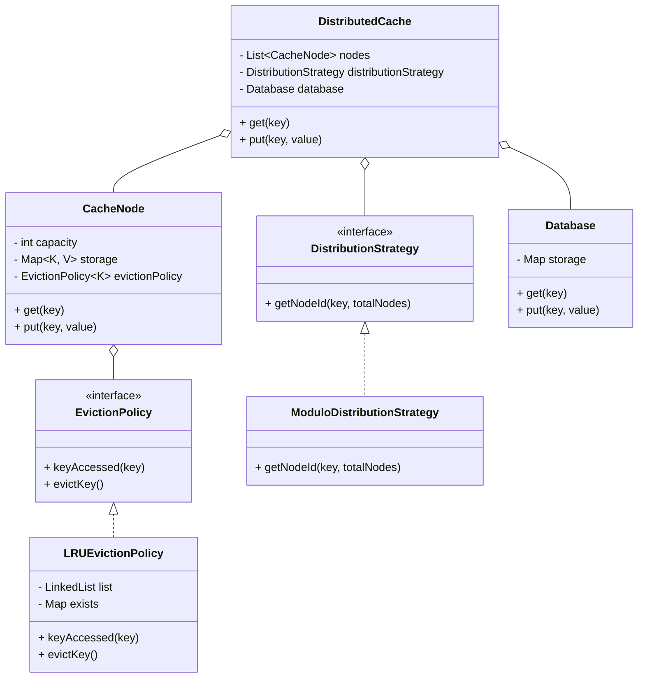

# Distributed Cache System (LLD)

## Features
- **Distributed Nodes**: Configurable number of nodes.
- **Cache Hit/Miss**: Automatically handles cache misses by fetching from the Database.
- **Pluggable Distribution Strategy**: Easy to switch between Modulo, Map-based, or Consistent Hashing.
- **Pluggable Eviction Policy**: Currently implements LRU, but can be extended to MRU, LFU, etc.

## Class Diagram (Mermaid)



## Explanation

### 1. Data Distribution
The `DistributedCache` orchestrator uses a `DistributionStrategy` to determine which `CacheNode` handles a specific key.
Currently, `ModuloDistributionStrategy` is implemented which calculates `Math.abs(key.hashCode()) % totalNodes`.
**Extensibility**: If consistent hashing is needed, we just implement `ConsistentHashingStrategy` and pass it to the `DistributedCache` constructor.

### 2. Cache Miss and Database Integration
When `get(key)` is called:
1. Orchestrator finds the appropriate node.
2. If node has the key, it's returned immediately.
3. If node does NOT have the key (Cache Miss), the orchestrator fetches the value from the `Database`, stores it in that node for future access, and returns it.

### 3. Eviction Policy
Each `CacheNode` has its own `EvictionPolicy`.
- **LRU (Least Recently Used)**: Tracks the order of access in a `LinkedList`.
- When a node reaches its capacity during a `put` operation, the `evictKey()` method of the policy is called to remove the least recently used key before adding the new one.
**Extensibility**: To support LFU, simply create an `LFUEvictionPolicy` class and swap it in the node initialization.

### 4. Design for Extensibility
- **Interfaces**: High-level components interact via interfaces (`DistributionStrategy`, `EvictionPolicy`), following the Dependency Inversion Principle.
- **Decoupling**: The distributed routing logic is decouped from the cache storage logic in the nodes.
- **Generics**: Uses Java generics `<K, V>` to support any data type for keys and values.

## How to run
Compile all Java files from the `src` directory and run `Main`.
```bash
javac src/**/*.java src/Main.java
java src/Main
```
