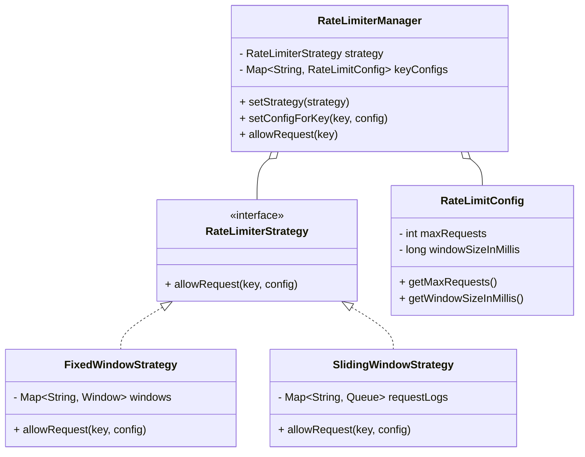

# Pluggable Rate Limiting System (LLD)

## Problem Overview
Designed a system to rate limit calls to external resources (e.g., third-party APIs) per key (customer, tenant, etc.). This ensures that we stay within our quota and don't get overcharged, even if internal API traffic is high.

## Features
- **Pluggable Algorithms**: Strategy pattern allows switching between Fixed Window and Sliding Window at runtime.
- **Granular Control**: Different limits for different keys (e.g., free-tier user vs. premium-tier user).
- **Thread Safe**: Concurrent hash maps and atomic operations/synchronized blocks ensure safe concurrent usage.

## Class Diagram (Mermaid)

## Explanation of Algorithms

### 1. Fixed Window Counter
- **How it works**: Divides time into fixed buckets (e.g., [00:01:00-00:02:00]). Each bucket has a count.
- **Trade-offs**: 
  - **Pros**: Very efficient (only stores a single count per key/window). Easy to implement.
  - **Cons**: Susceptible to "bursts" at window edges. A user could double the quota by making all requests at the end of window N and start of window N+1.

### 2. Sliding Window Log (Accurate Sliding Window)
- **How it works**: Tracks a timestamp for every request. On each new request, it cleans up logs older than `now - windowSize`. If the log size is within limits, it adds the new timestamp.
- **Trade-offs**:
  - **Pros**: Perfectly accurate. Prevents bursts at window edges.
  - **Cons**: High memory usage if `maxRequests` is large, as it stores every timestamp in memory. Cleaning up the queue can take time (O(n) where n = number of timestamps).

### 3. Design for Future Extensibility
- **Token Bucket**: To add this, implement `TokenBucketStrategy` where tokens are added periodically based on time elapsed since last request.
- **Leaky Bucket**: Implement `LeakyBucketStrategy` using a fixed-rate processing queue.

## Key Design Decisions
1. **Strategy Pattern**: Decouples the algorithm logic from the manager, allowing users to swap algorithms without changing usage code.
2. **Concurrent Storage**: `ConcurrentHashMap` ensures performant thread-safety when multiple threads access the same rate limiter.
3. **Internal Resource Guard**: The rate limiter is consulted only when an external call is about to happen, rather than on every incoming API request, as per the requirement.
